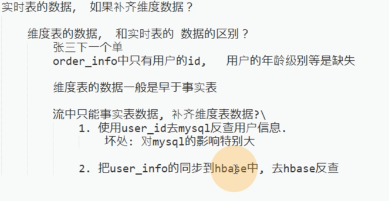
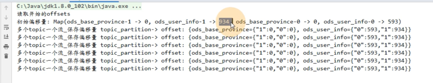

#### 从ods层来的order_info的数据类型为：

------------

补充2，实时监控user_info纬度表的数据，有变化就同步到hbase中

/**
*     key : offset:${groupId}        value(hash)
*                                    field          value
*                                    topic          partition+offset
*/
filedAndvalue :
{ods_topic={"分区1":"偏移量1","分区2":"偏移量2"}}
